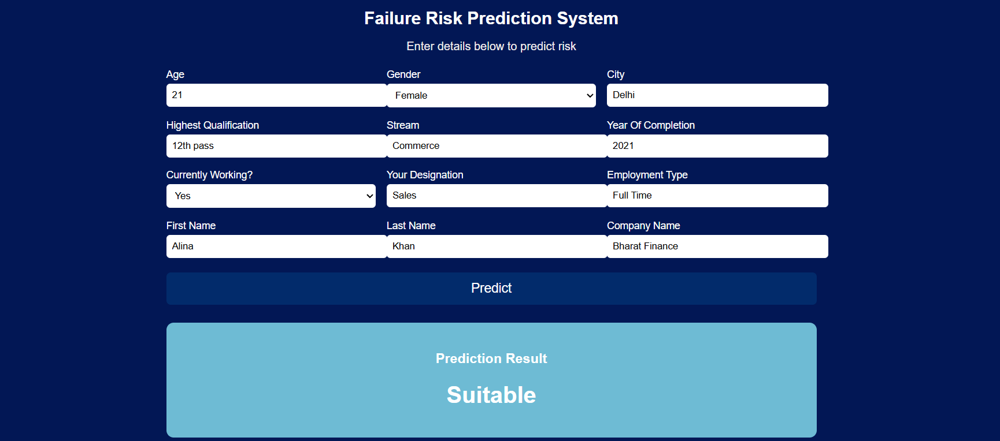

# Course Failure Risk Prediction System

The **Failure Risk Prediction System** is an end-to-end Machine Learning web application designed to predict whether a job profile / candidate profile is **Suitable**, **MidSenior_Not_Suitable**, or **Senior_Not_Suitable** based on multiple attributes.
It helps organizations automate the suitability screening process and reduce manual evaluation effort with data-driven predictions.

This project includes:

* Machine Learning Model
* REST API using **FastAPI**
* Interactive **HTML / CSS / JavaScript Frontend**
* Data preprocessing pipeline
* Visualization Support
* Fully deployable solution

---

## 🧠 Problem Statement

Organizations often struggle with:

* Evaluating large candidate datasets
* Identifying suitability levels
* Reducing screening time
* Making consistent objective decisions

This project predicts **Failure / Success suitability risk** by analyzing historical patterns and learning meaningful relationships from data.

---

## 🚀 Features

✔️ Clean Data Processing & Transformation
✔️ ML Classification Model
✔️ Handles Missing / Skewed Data
✔️ Multi-Class Prediction
✔️ Well Optimized Pipeline
✔️ Responsive UI 
✔️ Integrated Frontend + FastAPI Backend
✔️ Supports JSON & Web Requests
✔️ Visualization Support

---

## 🛠️ Tech Stack

**Machine Learning**

* Python
* Pandas, NumPy
* Scikit-learn

**Model**

* Random Forest (whichever you used)
* Label Encoding / Target Encoding
* Train-Test Split

**Backend**

* FastAPI
* Uvicorn

**Frontend**

* HTML
* CSS (Responsive UI )
* JavaScript (Fetch API)

**Deployment Ready**

* FastAPI
* Any Cloud (Render / Railway / Azure / AWS)

---

## 📊 Data Labels

Your dataset outputs:

* `Suitable`
* `MidSenior_Not_Suitable`
* `Senior_Not_Suitable`

---

## ⚙️ Optimization Techniques Used

### ✅ 1️⃣ Data Cleaning & Preprocessing

* Removed duplicates
* Handled missing values
* Converted categorical to numerical
* Normalized distributions where required

### ✅ 2️⃣ Feature Engineering

* Selected meaningful features
* Encoded categorical variables
* Avoided noise variables to prevent overfitting

### ✅ 3️⃣ Model Optimization

* Used `train_test_split`
* Tuned important hyperparameters
* Checked accuracy & performance

### ✅ 4️⃣ Performance Optimization

* Reduced model latency
* Ensured FastAPI responses are fast
* Optimized JSON response size

### ✅ 5️⃣ UI/UX Optimization

* Responsive Layout
* Grid-based design
* Mobile Friendly
* Clean & modern look

---

## 🖼️ Application Screenshot





## 📁 Project Folder Structure

```
Failure_Risk_Prediction_System
│
├── app.py                          # FastAPI main app (serves UI + APIs)
├── main.py                         # (Optional) CLI entry / runner if needed
├── requirements.txt                # All dependencies
├── setup.py                        # Package setup (optional)
├── README.md
│
├── artifacts/
│   ├── model.pkl
│   └── preprocessor.pkl
│
├── src/
│   ├── __init__.py
│   ├── data_ingestion.py
│   ├── data_transformation.py
│   ├── model_trainer.py
│   ├── model_evaluation.py
│   └── pipeline.py                 # full ML pipeline script
│
├── Notebook/
│   ├── EDA.ipynb
│   ├── Model_Building.ipynb
│   └── Testing.ipynb
│
├── templates/
│   └── index.html                  # Frontend HTML (FastAPI renders this)
│
├── static/
│   ├── style.css                   # CSS file
│   └── script.js                   # JS + chart.js calls
│
├── logs/
│   ├── app.log
│   └── pipeline.log
│
├── data/
│   ├── raw.csv
│   └── processed.csv
│
└── venv/                           # virtual environment (optional)

---

## ▶️ How to Run the Project

### Step 1 – Install Dependencies

```
pip install -r requirements.txt
```

### Step 2 – Run FastAPI Server

```
uvicorn main:app --reload
```

Server Runs On:

```
http://127.0.0.1:8000
```

### Step 3 – Open Frontend

Just open:

```
frontend/index.html
```

---

## 🌍 API Endpoint

```
POST /predict
```

Request Body Example

```json
{
 "feature1": "value",
 "feature2": "value",
 "feature3": "value"
}
```

Response

```json
{
 "prediction": "Suitable"
}
```

---

## 📌 Future Enhancements

* Add dashboard with analytics
* Deploy to cloud
* Add authentication
* Improve explanation interpretability (SHAP/LIME)
* Store predictions into database

---

## 🤝 Contributions

Pull requests are welcome!

---

## 📜 License

Open Source — Feel free to use and improve 🎯

---


